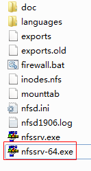

## 编译内核
1. `cp arch/arm/config/${Your Board}_defconfig .config`
2. `make ARCH=arm menuconfig`
menuconfig会进一步完善.config文件
3. `make ARCH=arm CROSS_COMPILE=${Your Cross Compile Prefix)- uImage `
e.g. make ARCH=arm CROSS_COMPILE=arm-linux- uImage

**可能会遇到的问题**
```
scripts/kconfig/lxdialog/dialog.h:32:20: fatal error: curses.h: No such file or directory

这是因为你没有libncurse库，输入sudo apt-get install libncurses5-dev libncursesw5-dev安装即可
```
```
Makefile:416: *** mixed implicit and normal rules: deprecated syntax
Makefile:1449: *** mixed implicit and normal rules: deprecated syntax

这是因为这个Linux源码的Makefile太老，你要把它不合语法的部分改掉
改之前：
config %config: scripts_basic outputmakefile FORCE
改之后：
%config: scripts_basic outputmakefile FORCE

改之前：
/ %/: prepare scripts FORCE
改之后：
%/: prepare scripts FORCE
```

```
内核编译成功，但没有生成uImage

uImage是用u-boot工具生成的，内核本身并不能生成，安装u-boot工具即可
apt-get install u-boot-tools
```

```
/bin/sh: 1: bison: not found

sudo apt-get install bison
```

```
/bin/sh: 1: flex: not found

sudo apt-get install flex
```

```
scripts/extract-cert.c:21:25: fatal error: openssl/bio.h

sudo apt-get install libssl-dev
```

## Linux挂载NFS
Windows用的软件是HaneWIN

[https://www.hanewin.net/nfs-e.htm](http://)

打开它




Linux挂载

`mount -t nfs -o nolock 192.168.1.11:/c/Users/hasee/Desktop /mnt/`

*注意：如果Linux开发板挂载不上Windows的这个软件的NFS服务器，那就用Linux做NFS服务器吧*

## 安装交叉编译器
```
tar xjf arm-linux-gcc-3.4.5-glibc-2.3.6.tar.bz2
sudo vim /etc/profile
	最后一行添加：
		export PATH=$PATH:/home/sam/Work/SoftWare/arm-linux-gcc-3.4.5/gcc-3.4.5-glibc-2.3.6/bin
	保存退出
. /etc/profile		# 注意"."和"/"之间有个空格

可能遇到的问题：
* -bash: ./arm-linux-gcc: No such file or directory
	解决：安装32位兼容库：sudo apt-get install lib32ncurses5 lib32z1
```

## 各种Linux命令
`cat /dev/tty1`

`hexdump /dev/event1`         # open(dev/event1)  秒 微妙 类 code value

`exec 0</dev/tty1`            # 把tty设为标准输入

`ls -l /proc/770/fd`          # 查看770这个进程打开了哪些文件


